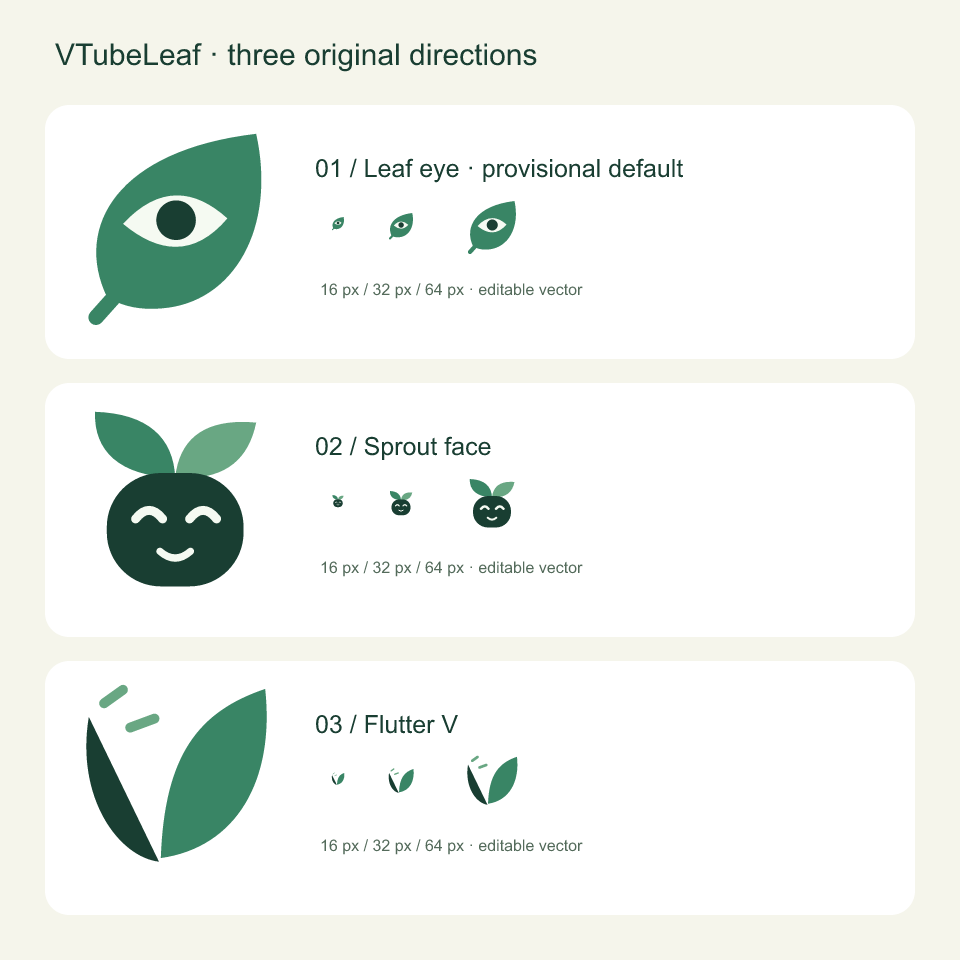

# VTubeLeaf 品牌资源

版本：2026-09-07 初稿。三套方向都已生成；`leaf-eye` 暂作开发图标，尚未由用户选稿。



## 方向

| 方向        | 表达与取舍                                                               | 源文件                                                       |
| ----------- | ------------------------------------------------------------------------ | ------------------------------------------------------------ |
| Leaf eye    | 一片叶子和眼睛，直接联系 Leaf 与面部跟踪；小尺寸识别较清楚，暂定用于开发 | [leaf-eye.svg](../public/brand/proposals/leaf-eye.svg)       |
| Sprout face | 发芽的笑脸，更接近轻松的角色工具；表情细节在最小尺寸弱化                 | [sprout-face.svg](../public/brand/proposals/sprout-face.svg) |
| Flutter V   | 两片叶子形成 V，短线表达轻盈动作；更抽象，需要名称共同建立识别           | [flutter-v.svg](../public/brand/proposals/flutter-v.svg)     |

图形与字标使用新绘制的 SVG 路径，没有沿用第三方产品 Logo 或字体轮廓。这里只完成了三方案的图形差异与小尺寸检查，尚未做外部图标库、同类软件和注册商标的完整相似性检索；不能据此承诺商标可注册。

## 暂定规范

| 用途             | 色值      |
| ---------------- | --------- |
| 叶片绿           | `#398565` |
| 深墨绿           | `#193E32` |
| 浅色眼部/背景    | `#F5FAF2` |
| 深色背景上的叶片 | `#8CCFA6` |
| 深色背景上的字标 | `#E8F3E9` |

- 浅色环境使用 `mark-light.svg` / `lockup-light.svg`，深色环境使用 `mark-dark.svg` / `lockup-dark.svg`。
- `mono` 版是深色墨线与白色眼部的黑白方案；深底优先使用专用 `dark` 版。
- 保留图形四周约 16% 图标宽度的空间；完整标志不拉伸、不旋转、不给眼部叠加元素。
- 独立图形最小建议 16px，带字标组合最小建议宽 180px；低于该宽度只用图形。
- 预览镜像、动作镜像和平台主题不应翻转品牌图形。
- 原创字标通过几何路径构建，不依赖用户安装字体；界面正文仍使用应用的系统字体。

## 文件清单

| 文件                                                                     | 用途                            |
| ------------------------------------------------------------------------ | ------------------------------- |
| `public/brand/proposals/*.svg`                                           | 三方案可编辑矢量源文件          |
| `public/brand/proposals.svg` / `.png`                                    | 三方案对照板与 16/32/64px 预览  |
| `public/brand/mark.svg`                                                  | 当前开发默认图形，等同 light 版 |
| `public/brand/mark-{light,dark,mono}.svg`                                | 独立图形版本                    |
| `public/brand/wordmark-{light,dark,mono}.svg`                            | 独立 VTubeLeaf 字标             |
| `public/brand/lockup-{light,dark,mono}.svg`                              | 横向组合                        |
| `public/brand/png/{16,32,64,128,256,512,1024}x*.png`                     | 透明背景位图                    |
| `src-tauri/icons/32x32.png`、`128x128.png`、`128x128@2x.png`、`icon.png` | 桌面应用 PNG                    |
| `src-tauri/icons/icon.ico` / `icon.icns`                                 | Windows / macOS 图标容器        |

## 重建与检查

```sh
npm ci
node scripts/brand.mjs
```

[brand.mjs](../scripts/brand.mjs) 是图形和字标的可重建源，使用已安装 Tauri CLI 导出 PNG、ICO 与 ICNS，没有额外图形依赖。重新运行会覆盖上述品牌工件；如需正式选稿或修改路径，先改脚本再导出。

本次已检查 PNG 尺寸、RGBA 通道、ICO/ICNS 文件头，并实际查看提案板及 128px 图标。系统 Dock、菜单栏、开始菜单、Linux 启动器的背景适配和高 DPI 显示仍待目标平台检查。当前工件可供审阅和开发使用，品牌定稿与平台展示验收尚未完成。
