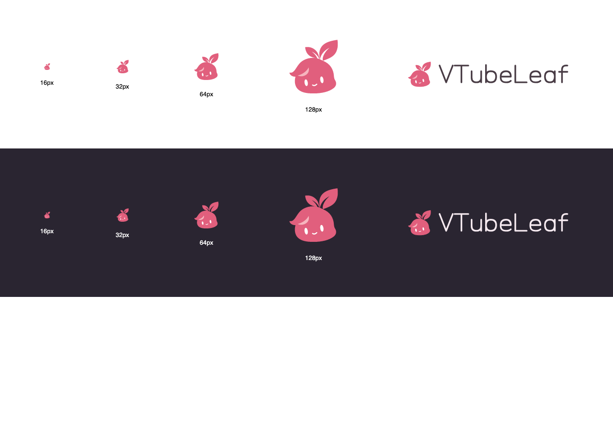

# VTubeLeaf 品牌资源

2026-09-08 选定第 02 号「叶芽精灵」白色五官版：粉色叶芽、浅粉额头高光、白色双眼和微笑。


图形依据选定的 GPT Image 2 稿重新绘制为可编辑 SVG 路径，使用平面色，适合透明背景和小尺寸导出。横向组合继续使用项目原有的几何字标路径，不依赖用户安装字体。

## 颜色与使用

| 用途               | 色值      |
| ------------------ | --------- |
| 叶芽粉             | `#E15F7D` |
| 额头高光           | `#F6B5BE` |
| 双眼和微笑         | `#FFFFFF` |
| 浅底字标、单色图形 | `#493C45` |
| 深底字标           | `#F6EAF0` |

- 浅色环境使用 `mark-light.svg` / `lockup-light.svg`，深色环境使用 `mark-dark.svg` / `lockup-dark.svg`。两种环境保留相同的粉色图形和白色五官。
- 五官是实色白色，不是透明镂空；图形外部与叶片间隙透明。
- `mono` 版用于单色场景。图形最小建议 16px，横向组合最小建议宽 180px；较窄空间只用图形。
- 保留文件自带留白，不拉伸、不旋转；预览镜像与动作镜像不应翻转品牌图形。

## 文件与重建

| 文件                                                 | 用途                                               |
| ---------------------------------------------------- | -------------------------------------------------- |
| `public/brand/mark.svg`                              | 默认图形，与 light 版一致；应用界面与 favicon 使用 |
| `public/brand/mark-{light,dark,mono}.svg`            | 独立图形                                           |
| `public/brand/wordmark-{light,dark,mono}.svg`        | 独立字标                                           |
| `public/brand/lockup-{light,dark,mono}.svg`          | 横向组合，README 使用 light 版                     |
| `public/brand/png/{16,32,64,128,256,512,1024}x*.png` | 透明背景 PNG                                       |
| `src-tauri/icons/`                                   | 桌面应用 PNG、Windows ICO、macOS ICNS              |
| `website/public/assets/brand/`                       | 官网图形与深浅色组合，由同一脚本同步               |

```sh
node scripts/brand.mjs
```

[brand.mjs](../scripts/brand.mjs) 是图形与字标的可重建源，使用已安装的 Tauri CLI 导出 PNG、ICO 与 ICNS，并检查 PNG 尺寸、RGBA 通道及容器文件头。修改时先改脚本，再导出。

`public/brand/proposals/` 与 `proposals.svg` / `.png` 保留为早期方案存档，不参与当前品牌导出。

## macOS 26 应用图标

2026-09-22 选定第 1 张「暖白瓷底」方向：暖白底色 `#FFF9F7`、原有粉色叶芽、轻微浮起的阴影。主体约占图标高度的 74%，留出叶尖与边缘的空间。

- 原生资源为 `src-tauri/icons/AppIcon.icon/`，`icon.json` 保存底色、图层位置和材质设置，可用 Apple Icon Composer 打开。
- 前景 `Assets/sprout.png` 由品牌脚本同步原始 1024px 透明 PNG；不在图片中绘制圆角、外框或阴影，由系统根据图层生成效果。
- `src-tauri/icons/Assets.car` 是用 Xcode 26 actool 从 `.icon` 预编译好的产物，Tauri 直接打包它并从中读取 `CFBundleIconName`；构建期不再调用 actool（Node 版 Tauri CLI 调用 actool 会随机崩溃，见 tauri-apps/tauri#15315）。macOS CI 构建后检查原生图标及 ICNS 均已打包。
- 修改 `.icon` 后需重新生成 `Assets.car`：在装有 Xcode 26+ 的机器上把 `AppIcon.icon` 复制为 `Icon.icon`，运行 `actool Icon.icon --compile out --app-icon Icon --include-all-app-icons --output-partial-info-plist out/Info.plist --platform macosx --target-device mac --minimum-deployment-target 26.0`，再把 `out/Assets.car` 提交。
- 旧版 macOS 保留原有透明 `icon.icns` 回退；Windows 与网页继续使用原来的透明图形。
- 本地 Xcode 版本不影响打包，因为不再编译 `.icon`。验证新图标需在 macOS 26+ 检查实际显示；概念效果图不能代替系统渲染验收。

## 已确认效果归档

2026-09-09 确认并归档「叶芽精灵」白色五官版效果图，保留 16 / 32 / 64 / 128px 图形与横向组合在深浅底色上的展示。图片原样保存，作为本次选定版本的视觉记录。


