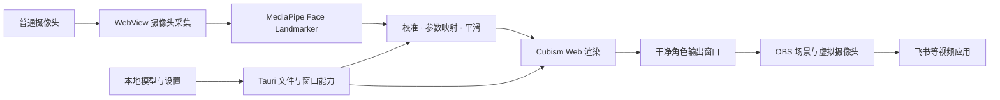

# VTubeLeaf 产品需求文档

版本：v0.1 · 讨论整理稿  
日期：2026-09-07  
产品名称：**VTubeLeaf**  
产品描述：**开源、免费、轻量的跨平台 Live2D 面捕工具**  
建议仓库名：`vtubeleaf`（尚未创建）

本文整理此前讨论中的产品需求、替代方案、技术取舍、验证工作和品牌任务。标为「已确认」的是用户明确表达的方向；标为「建议」的是用于推进开发的默认方案；标为「待验证」的是尚无实际运行证据的能力。本文不表示应用已经开发、跨平台测试通过或 SDK 发布授权已经取得。

**实施补充（2026-09-07）：** 用户在实施时明确要求增加 OpenSeeFace 作为备选，因此覆盖第 6.5 节“仅在 MediaPipe 验收不足时追加”的限制。本次提供 MediaPipe 默认引擎、OpenSeeFace 本机 UDP 接收及可选 Python 进程启停，共用参数映射与调节。品牌已提供三份矢量提案及暂定叶眼图标，最终选稿仍待确认。代码和验证进度分别见 [README](../README.md) 与 [VALIDATION](VALIDATION.md)，正文保留原始需求口径。

## 1. 产品定位与需求来源

VTubeLeaf 是一个桌面应用：通过普通摄像头捕捉用户的头部转动、眼睛和嘴部动作，实时驱动已经绑定好的 Live2D 二维角色，再将角色画面接入飞书会议等视频应用。

最初需求是在 Mac 上，免费使用二维虚拟形象参加飞书会议，并明确排除 VTube Studio。后续定位扩展为开源、免费、轻量、跨平台，因此产品面向 macOS、Windows 和 Linux，不采用 Mac 专属品牌或架构。

**建议以 Mac → OBS 虚拟摄像头 → 飞书会议作为首条完整验收路径**，随后验证 Windows、Linux。首条路径的优先级不等于仅支持 Mac，也不意味着其他平台可以只编译、不测试。

### 1.1 已确认与待定事项

| 事项                               | 状态           | 本文采用的口径                                   |
| ---------------------------------- | -------------- | ------------------------------------------------ |
| 产品名 VTubeLeaf                   | 已确认         | 名称保持 VTube 与轻盈叶片意象的联系              |
| 开源、免费、轻量、跨平台           | 已确认         | 作为功能、架构和发布取舍的约束                   |
| Live2D 二维角色面捕                | 已确认         | 不以 VRoid 等三维角色替代                        |
| 桌面应用形态                       | 已确认         | 体验目标接近面捕工具，而非单独网页演示           |
| 首个真实使用场景                   | 已确认         | Mac 上通过虚拟形象参加飞书会议                   |
| Tauri 方向                         | 用户提出并讨论 | 建议采用 Tauri 2，先验证实际打包运行环境         |
| MediaPipe JS + Cubism Web          | 建议           | 优先降低首版集成成本，不宣称跟踪效果优于所有方案 |
| OBS 虚拟摄像头                     | 建议           | 首版会议输出路径，原生虚拟摄像头后置             |
| Logo 创作                          | 已要求规划     | 本文列出独立任务；尚未选稿或生成成品             |
| 开源许可证、最低系统版本、性能预算 | 待定           | 在技术验证和发布审查阶段确定                     |
| Live2D SDK 的公开发布条件          | 待核实         | 属于公开发行前的必要决策，详见第 11 节           |

### 1.2 「免费」与「开源」的具体含义

- **用户免费**：目标是基础面捕、模型使用和会议输出不收费，不人为添加水印、时长限制或付费解锁门槛。
- **无需付费 AI 服务**：默认在本机运行，不依赖云端推理或 API Key；下载应用及所需资源后，应能离线完成面捕。
- **项目源码开放**：开放 VTubeLeaf 自有代码和构建说明，具体许可证在发行前确定。
- **分别说明第三方条件**：Live2D SDK、模型、字体、图标等遵循各自许可。项目开源不能把第三方组件自动变成同一许可证。
- **模型制作另计**：应用免费不代表任意角色模型免费，也不包含把一张图片自动制作为可驱动 Live2D 模型。
- **开发和发行成本另计**：签名、分发和 SDK 许可可能产生开发者成本，不能据此向用户承诺项目所有环节均为零成本。

## 2. 用户与使用场景

### 2.1 主要用户

1. 希望在会议里使用二维虚拟形象、又不愿购买面捕软件的普通用户。
2. 已经持有合法可用的 Live2D 模型，希望快速接入摄像头和 OBS 的个人创作者。
3. 希望在不同操作系统上使用同一套开放工具的开发者及开源社区用户。

### 2.2 核心用户故事

| 编号  | 用户故事                                 | 完成标准                                                                   |
| ----- | ---------------------------------------- | -------------------------------------------------------------------------- |
| US-01 | 我希望打开应用后很快看到角色随我活动     | 选择模型、允许摄像头、校准后，头部、眼睛和嘴部能够跟随                     |
| US-02 | 我希望在飞书中展示角色而不是摄像头原画   | 飞书能选择 OBS 虚拟摄像头，对方看到干净的角色画面                          |
| US-03 | 我希望开会时不用一直把面捕窗口放在最前面 | 飞书获得焦点后仍能稳定跟踪和输出；窗口最小化等状态单独验证并明确支持边界   |
| US-04 | 我希望免费完成长时间会议                 | 应用不设人为时限；连续运行达到验收时长，无意外停止                         |
| US-05 | 我希望在自己的电脑上处理人脸数据         | 正常面捕不上传摄像头画面、面部参数，不依赖云端服务                         |
| US-06 | 我希望使用自己的 Live2D 模型             | 在声明支持的模型版本范围内导入成功，错误能定位到具体缺失资源或不支持的格式 |

## 3. 成功标准与首版范围

首版应完成「摄像头 → 面捕 → Live2D → OBS → 飞书」闭环，并能让用户在下一次启动时复用模型和设置。优先保证基础表情自然、会议期间可靠、安装和运行负担可解释。

### 3.1 P0：首个可用版本

| 能力       | 要求                                                                                              |
| ---------- | ------------------------------------------------------------------------------------------------- |
| 桌面应用   | Tauri 应用；完成各目标平台的独立验证后再声明该平台可用                                            |
| 模型加载   | 先用一个许可明确的固定模型验证；随后支持选择包含 `.model3.json`、`.moc3` 和引用资源的本地模型目录 |
| 摄像头     | 设备选择、授权状态、启动、暂停、停止和切换；清楚提示摄像头是否正在使用                            |
| 基础面捕   | 单人头部转动、眨眼、嘴部开合；支持的附加表情随模型能力呈现                                        |
| 校准和调节 | 中立姿态校准、灵敏度、平滑程度、镜像显示；保留不同摄像头和模型的调节空间                          |
| 角色显示   | 位置、缩放、纯色背景；适合 OBS 捕获的干净输出窗口                                                 |
| 会议接入   | 可复现的 OBS 虚拟摄像头配置说明，以及首条飞书真实会议验证                                         |
| 本地设置   | 保存模型路径和常用设置；重新打开时资源失效能恢复，不静默失败                                      |
| 免费与隐私 | 无人为水印、时限、账号要求；面捕默认本地运行                                                      |

### 3.2 P1：完成首版体验与公开发行准备

- ZIP 模型包导入：在目录导入稳定后实现；检查路径穿越、解压范围、资源体积和错误反馈。
- 模型切换体验、常用模型列表；视真实需求增加每模型独立的校准与映射设置。
- 补齐模型支持范围内的表情映射、背景选项和配置说明。
- 完成 Windows、Linux 的摄像头、渲染、后台运行和会议接入实测。
- 完成安装包、签名及系统提示说明、第三方许可清单、示例模型分发确认。
- 完成 Logo、应用图标和简短品牌规范，统一仓库、安装包与应用内展示。

其中，**公开发行所需的许可核实、安装与隐私说明是发布门槛**，不能因标为发行准备而略过。

### 3.3 首版不包含

- 原生虚拟摄像头驱动或扩展。
- Live2D 模型绘制、切图、绑定和编辑器。
- 从单张 PNG 自动生成完整 Live2D 模型。
- VRM、VRoid 等三维角色方案，全身及手部动作捕捉。
- iPhone ARKit、Android 外部跟踪、网络遥控和多人跟踪。
- 云端面捕、账号系统、订阅、模型商城和插件市场。
- 多跟踪引擎切换框架、自行训练面捕模型。
- 将透明窗口、OBS 透明捕获和虚拟摄像头透明传输视为必然支持的完整链路。

这些能力只在出现明确需求或首选方案被实测证明不足时进入后续计划。

## 4. 核心使用流程

### 4.1 第一次使用

1. 安装并打开 VTubeLeaf，阅读简短的本地处理和摄像头使用说明。
2. 选择一个可用的 Live2D 模型目录；若随应用提供示例模型，必须先确认分发许可。
3. 选择摄像头并授予系统权限；拒绝或设备不可用时，显示恢复方法。
4. 面向摄像头、保持自然表情，执行中立姿态校准。
5. 调整角色大小、位置、镜像和必要的灵敏度，确认头部、眨眼、嘴部跟随自然。
6. 打开干净输出窗口，在 OBS 中捕获该窗口或对应系统捕获源，并裁剪至角色画面。
7. 在 OBS 中启动虚拟摄像头，在飞书会议中选择 OBS Virtual Camera。
8. 飞书继续使用用户原来的麦克风；基于人脸的嘴部跟踪不要求 VTubeLeaf 使用麦克风。

OBS 提供将场景作为虚拟摄像头输出的功能；各平台的安装和故障处理应按官方说明验证。[OBS Virtual Camera Guide](https://obsproject.com/kb/virtual-camera-guide)

### 4.2 再次使用

恢复上次模型和显示设置 → 检查摄像头权限与设备 → 开始跟踪 → 必要时重新校准 → 复用 OBS 场景 → 飞书选择虚拟摄像头。

为了让摄像头状态可预期，**建议默认由用户主动开始采集**。是否提供「启动后自动跟踪」选项，等基础流程稳定后决定。

### 4.3 暂停、丢脸和退出

- 暂停跟踪：停止面捕更新，角色平滑回到中立状态或明确的静止状态，设置界面显示已暂停。
- 停止摄像头：释放摄像头资源；不能仅隐藏预览却继续采集。
- 短暂丢失人脸：避免角色长期停在夸张表情；超过短暂容错时间后平滑回中立，重新识别后恢复。
- 摄像头断开或被其他应用占用：提示原因与恢复操作，不暴露摄像头原画作为输出回退。
- 关闭应用：释放摄像头和推理资源。OBS 在来源消失后的画面行为也需要验证，并在接入说明中交代。

## 5. 功能需求与验收

| 编号  | 功能         | 要求与验收                                                                                     |
| ----- | ------------ | ---------------------------------------------------------------------------------------------- |
| FR-01 | 模型导入     | 合法模型可加载；入口文件、核心模型或纹理缺失时给出具体提示；不把损坏模型当作摄像头故障         |
| FR-02 | 格式支持声明 | 根据实际 Cubism Runtime 和样例确定兼容范围；不因其他工具支持 Cubism 2/4，就宣称本项目全部兼容  |
| FR-03 | 摄像头管理   | 可列出并选择设备；授权拒绝、设备拔出、切换失败均有可恢复状态；停止后实际释放设备               |
| FR-04 | 基础动作     | 头部左右/上下转动及倾斜、左右眼开合、嘴部开合可驱动；缺少某参数的模型仍可使用其他能力          |
| FR-05 | 参数边界     | 根据模型参数 ID、最小值和最大值映射并限制输出，防止越界或把通用假设强加给模型                  |
| FR-06 | 校准         | 可在当前坐姿和摄像头角度下重新设置中立姿态；校准前后效果可观察                                 |
| FR-07 | 平滑与灵敏度 | 至少提供易理解的平滑和灵敏度控制；头部、眼睛、嘴部在需要时独立调节，避免一个平滑值导致眨眼迟钝 |
| FR-08 | 镜像与方向   | 区分预览镜像和动作方向；验证转头方向、左右眼、输出画面一致，不出现重复镜像                     |
| FR-09 | 丢脸恢复     | 遮脸、离开画面和重新进入后，角色能回中立并重新跟踪，无持续错误表情或突跳失控                   |
| FR-10 | 干净输出     | 输出中只出现角色及背景，不带设置面板、调试信息或摄像头原画；窗口尺寸和布局适合 OBS 稳定捕获    |
| FR-11 | 显示调节     | 可调整角色缩放、位置和纯色背景；不同长宽比下不意外裁掉主要表情区域                             |
| FR-12 | 设置保存     | 正常退出再打开后保留设置；模型被移动、配置损坏时有清楚的修复入口                               |
| FR-13 | 后台运行     | 飞书在前台且 VTubeLeaf 不聚焦时，继续跟踪和输出；最小化、遮挡等状态按平台分别记录实测结论      |
| FR-14 | 故障说明     | 区分权限、摄像头、跟踪、模型、渲染、OBS 和会议端问题；提供短提示及必要日志，不让用户猜测       |
| FR-15 | 本地隐私     | 默认不记录视频和面部轨迹；日志不包含原始帧及敏感路径内容；正常面捕断网可用                     |
| FR-16 | 基础可用性   | 设置控件可通过键盘访问，有可读名称、焦点和清楚状态；核心流程使用中文，文案结构便于后续翻译     |

## 6. 技术方案

### 6.1 建议架构

| 层             | 建议技术                                              | 职责                                           |
| -------------- | ----------------------------------------------------- | ---------------------------------------------- |
| 桌面壳         | Tauri 2 / Rust                                        | 窗口、受限文件访问、配置读写、打包和系统集成   |
| 交互与运行逻辑 | TypeScript                                            | 摄像头控制、校准设置、状态提示、跟踪与渲染协调 |
| 面部跟踪       | MediaPipe Face Landmarker / `@mediapipe/tasks-vision` | 本地提取面部特征和表情系数                     |
| 模型运行时     | Live2D Cubism SDK for Web                             | 加载并渲染受支持的 Live2D 模型                 |
| 会议输出       | OBS Virtual Camera                                    | 将角色场景转换为会议软件可选择的摄像头来源     |

首版不要求将推理重写为 Rust，也不需要附带 Python 运行环境。复用 JS/WASM 方案，先验证完整链路。

**全应用只运行一套面捕推理。** 如果设置界面与输出分为两个窗口，只同步设置或必要参数，避免跨进程逐帧搬运视频。推理具体放在哪个窗口或 Worker 中，由实际打包环境和后台测试决定，不提前构建复杂通信框架。

### 6.2 Tauri 与 Electron 的取舍

早期讨论过 Electron + TypeScript，它适合快速获得统一 Chromium 环境。考虑用户提出的 Tauri 方向及轻量目标，本文建议优先验证 Tauri。

| 方案     | 主要价值                                             | 需要承担的代价                                                | 本项目处理                         |
| -------- | ---------------------------------------------------- | ------------------------------------------------------------- | ---------------------------------- |
| Tauri    | 复用系统 WebView，通常可降低应用自带浏览器的分发负担 | 各系统 WebView 不一致，摄像头、WASM、渲染和后台行为需分别验证 | 首选验证                           |
| Electron | 浏览器环境更一致，Web 生态集成直接                   | 自带 Chromium/Node 的安装与运行负担                           | 作为评估过的备选，不同时维护两套壳 |

Tauri 在 Windows 使用 WebView2，macOS 使用系统 WebKit/WKWebView，Linux 使用 WebKitGTK。不能把某个 Chromium 浏览器中的成功结果直接当作全部 Tauri 平台的结果。[Tauri Webview Versions](https://v2.tauri.app/reference/webview-versions/)

**安装包更小，不等于 CPU 或内存一定更低。** 推理频率、模型、纹理和渲染负载仍是主要测量对象。只有当 Tauri 在明确支持的环境中存在无法合理解决的兼容性阻碍时，才重新评估替代方案。

### 6.3 MediaPipe 集成要点

Face Landmarker 可输出 478 个三维面部关键点、52 个表情系数，以及可选的面部变换矩阵。这些是算法输出，需要进一步转换成具体 Live2D 模型的参数。[Face Landmarker 概览](https://ai.google.dev/edge/mediapipe/solutions/vision/face_landmarker)

建议采用单人、视频模式：`runningMode: "VIDEO"`、`numFaces: 1`，按需启用 `outputFaceBlendshapes` 和 `outputFacialTransformationMatrixes`。视频检测调用会同步占用执行线程，因此要验证 Worker 或受控调度，避免推理阻塞界面；不得无限排队处理旧帧。[Face Landmarker Web Guide](https://ai.google.dev/edge/mediapipe/solutions/vision/face_landmarker/web_js)

实现要求：

- 将运行所需的 WASM、跟踪模型和资源纳入明确的本地加载方案，避免启动时暗中依赖 CDN。
- 验证摄像头、推理和 WebGL 渲染能在同一实际应用环境中同时运行。
- 推理跟不上时处理最新可用帧，不追赶积压帧；跟踪频率与绘制频率可以分开。
- 以实测决定 CPU/GPU 路径，不假设每个 WebView 都有同样的 GPU 或 WebGPU 支持。
- 官方 JS 示例列有 Safari，但这只支持可行性判断，仍需测试 Tauri 打包应用。[MediaPipe JS 示例说明](https://github.com/google-ai-edge/mediapipe-samples/blob/main/examples/face_landmarker/js/README.md)

### 6.4 Live2D 参数映射

基础映射覆盖头部、左右眼和嘴部。`ParamAngleX/Y/Z`、`ParamEyeLOpen`、`ParamEyeROpen`、`ParamMouthOpenY`、`ParamMouthForm` 仅作为常见参数示例，不是所有模型必须拥有的接口。

处理顺序建议为：读取模型能力与边界 → 摄像头方向和中立姿态校准 → 计算目标参数 → 按动作平滑 → 限制在模型范围内 → 更新渲染。

首轮重点验证：

- 正面和轻微转头时眨眼是否可靠，是否容易出现眼睛长期半闭。
- 自然说话时嘴部能否正常闭合，是否因灵敏度过高持续张嘴。
- 大角度转头、低光、眼镜、距离变化和部分遮挡下是否出现明显抖动。
- 平滑是否改善抖动但带来过大延迟，丢脸后能否自然恢复。
- 模型原有待机、物理或表情更新是否覆盖面捕参数；根据使用的 SDK 流程验证更新顺序。

### 6.5 OpenSeeFace 对比与备用条件

OpenSeeFace 是开源面部跟踪组件，预训练模型可直接使用。其代码与模型采用 BSD-2-Clause；典型实现使用 Python、OpenCV、基于 MobileNetV3 的模型、ONNX Runtime CPU 推理，并能通过 UDP 传递跟踪结果。它不是包含 Live2D 渲染和会议输出的完整桌面应用。[OpenSeeFace](https://github.com/emilianavt/OpenSeeFace)

| 维度           | MediaPipe JS                         | OpenSeeFace                                      |
| -------------- | ------------------------------------ | ------------------------------------------------ |
| 与当前方案集成 | 可在 TypeScript/WebView 路径中接入   | 通常需要管理独立跟踪进程及通信                   |
| 主要开发工作   | WebView 兼容性、调度和 Live2D 映射   | 跟踪进程打包、生命周期、跨平台依赖和 Live2D 映射 |
| 跟踪效果       | 需用本项目摄像头、人物姿态和模型验证 | 同样需要实测，不能只凭其他产品使用就判定更好     |
| 首版决定       | 先验证和使用                         | 当前不实现；在明确短板出现后做有针对性的对比     |

讨论中提到的 OpenSeeFace 在低画质、较大姿态、嘴部跟踪等方面的特点，属于项目作者的描述及既有使用经验，不能当作与当前 MediaPipe 版本的最新对照测试；眼睛跟踪等表现也需具体测量。

只有 MediaPipe 无法达到已确定的跟踪或性能验收条件，并且 OpenSeeFace 在相同测试中有明确收益，才追加第二引擎任务。无需先搭建多引擎抽象。

### 6.6 VTube Studio 的参考边界

此前讨论涉及 VTube Studio 默认采用 OpenSeeFace，以及可选的 MediaPipe、NVIDIA RTX、手机跟踪路线。其 MediaPipe 文档描述的是该产品内的特定集成，并有 Windows 平台限制；这不等于 MediaPipe JS 不能用于 Mac。[VTube Studio MediaPipe Tracker](https://github.com/DenchiSoft/VTubeStudio/wiki/Mediapipe-Webcam-Tracker)

iPhone ARKit、Android Mocap4Face 等属于手机跟踪路径，不纳入本项目首版。[VTube Studio Introduction & Requirements](https://github.com/DenchiSoft/VTubeStudio/wiki/Introduction-%26-Requirements)

「为什么 VTube Studio 默认使用 OpenSeeFace」涉及历史、平台和集成连续性的解释，只能作为推测，未取得官方动机说明。相关旧文档的姿态范围或 CPU/GPU 描述，也不能替代本项目的性能比较。

## 7. 跨平台与会议接入验证

### 7.1 支持矩阵

| 平台    | 运行环境                | 发布前必须验证                                                                     | 当前状态                 |
| ------- | ----------------------- | ---------------------------------------------------------------------------------- | ------------------------ |
| macOS   | WKWebView / 系统 WebKit | 打包 `.app` 摄像头权限、资源加载、推理与 WebGL、非前台运行、OBS 捕获、飞书真实会议 | 未实测；建议首条验证路径 |
| Windows | WebView2                | 运行时安装、摄像头权限和切换、推理与渲染、后台输出、OBS 与会议端                   | 未实测                   |
| Linux   | WebKitGTK               | 选定发行版依赖、摄像头和渲染、窗口系统与捕获方式、虚拟摄像头及会议端可用路径       | 未实测；需先确定支持范围 |

M0 阶段确定最低系统版本、CPU 架构、基准设备、Linux 发行版及窗口系统范围。macOS Apple Silicon 与 Intel 的覆盖应分别列出，不用「Mac 支持」掩盖只有一种架构的验证。

最低系统版本应由 Tauri、MediaPipe、Cubism 和 OBS 整条链路共同决定。此前提到的 OBS/macOS 版本建议只用于兼容性排查，不直接作为 VTubeLeaf 已确定的系统要求。

### 7.2 macOS 特别验证

- 在实际打包应用中申请摄像头权限，配置 `NSCameraUsageDescription`；根据分发方式确认沙盒、签名及摄像头权限配置。[Apple 摄像头使用说明键](https://developer.apple.com/documentation/bundleresources/information-property-list/nscamerausagedescription)
- 权限拒绝后，用户可以找到正确的系统设置恢复路径。
- 测试窗口不聚焦、被遮挡、最小化、显示器变化时，跟踪和捕获是否继续；分别记录，不合并成一句「支持后台」。
- 检查 OBS 捕获来源、屏幕录制相关授权及虚拟摄像头安装状态；排查流程参考官方资料。[OBS Virtual Camera Troubleshooting](https://obsproject.com/kb/virtual-camera-troubleshooting)

### 7.3 输出画面与透明度

P0 以稳定的纯色背景输出为基础。用户可以在 OBS 中构建背景、裁剪或使用色键，但透明效果需要对具体捕获方式实测。

应用窗口透明、OBS 来源带透明、最终虚拟摄像头保留透明，是不同能力。会议端通常接收合成后的普通视频画面，因此不能承诺通过虚拟摄像头传递角色 Alpha。透明捕获、Syphon 等专门输出可另行研究。

### 7.4 原生虚拟摄像头的后续门槛

原生输出可以减少 OBS 配置步骤，但需要平台专项开发。macOS 的 Camera Extension 涉及 CoreMediaIO、系统扩展及相应签名和授权流程；Tauri 不会自动消除这些工作。[Apple Camera Extension](https://developer.apple.com/documentation/CoreMediaIO/creating-a-camera-extension-with-core-media-i-o)

Windows、Linux 也要独立调研实现与分发条件。在 OBS 路径可用、用户需求明确前，不将原生虚拟摄像头放入 MVP。

## 8. 非功能需求与性能验收

以下数字是**建议的初始测试目标，不是已测结果或对所有硬件的保证**。M0 选择基准设备和模型后冻结验收条件，记录设备、系统、分辨率、模型纹理大小、是否接通电源等因素。

| 项目     | 初始目标 / 测量要求                                                                      |
| -------- | ---------------------------------------------------------------------------------------- |
| 角色渲染 | 基准设备上以稳定 30 FPS 为首轮目标；记录掉帧和实际帧率分布                               |
| 面捕更新 | 先尝试 20–30 次/秒；允许按性能降低，并与渲染频率分离                                     |
| 本地响应 | 先以动作至本地角色画面约 150 ms 内为调优目标；明确测量方法，不将网络会议延迟算成算法延迟 |
| 连续运行 | 至少 2 小时会议场景，无崩溃、摄像头意外释放、持续停更或明显持续内存增长                  |
| 后台状态 | 飞书前台时保持输出；最小化、遮挡和其他窗口状态逐项验收                                   |
| 资源负担 | 记录空闲、跟踪、OBS 同时运行的 CPU、内存和温度/风扇表现；CPU 口径和进程范围保持一致      |
| 安装体积 | 分开记录安装包、应用本体、面捕资源、示例模型和外部运行时；M0 后制定预算                  |
| 启动体验 | 区分冷启动、模型加载和首次推理时间；不在未测前承诺秒开                                   |
| 离线能力 | 必需资源已安装后断网运行，模型加载、面捕、角色渲染正常                                   |
| 可恢复性 | 拔插摄像头、权限拒绝、模型缺失、跟踪丢失等场景有明确恢复路径                             |

「轻量」需有安装体积和实际负载记录。不能仅因采用 Tauri，便宣称比 VTube Studio 或 Electron 方案更省 CPU、内存。

## 9. 验证方案与证据要求

### 9.1 最小验证顺序

1. **运行环境验证**：真实 Tauri 打包应用取得摄像头，加载本地 MediaPipe 资源并输出稳定结果。
2. **角色驱动验证**：一个已绑定且许可明确的模型，完成头部、眨眼和嘴部映射。
3. **会议闭环验证**：干净窗口 → OBS → 飞书，使用另一参会端确认实际收到的画面。
4. **可靠性验证**：后台状态、丢脸恢复、设备切换、错误路径和 2 小时连续运行。
5. **平台扩展验证**：按相同核心场景验证 Windows、Linux，并记录平台差异。

### 9.2 测试材料

- 记录应用版本、SDK/跟踪模型版本、系统、设备和模型信息。
- 保留启动、授权、模型加载、基础表情、干净输出及会议端结果的必要截图或短录屏。
- 记录性能样本、异常日志及复现步骤；默认不保存用户摄像头原画或面部轨迹。
- 使用多种头部姿态、光线、眼镜/遮挡和坐姿距离验证，不以单一正面演示代替日常可用性。
- 支持多个模型后，至少验证不同参数能力的模型，确认缺失参数能够降级。

源码审查、单元测试、浏览器演示和编译成功分别证明各自范围，**不能代替打包应用或真实会议验证**。

## 10. 本地数据与资源安全

| 数据                 | 首版处理                                                       |
| -------------------- | -------------------------------------------------------------- |
| 摄像头帧             | 仅在本机运行期间使用，默认不持久化、不上传                     |
| 面部关键点与表情系数 | 仅用于驱动角色，默认不保存历史                                 |
| 模型文件             | 从用户选择的本地位置读取；不自动上传或公开                     |
| 常用设置             | 保存模型引用、显示和面捕设置，支持恢复默认                     |
| 日志                 | 记录必要的错误类型和状态；不嵌入原始帧、连续面部数据或敏感内容 |

模型包是外部输入，需要检查入口、资源引用、路径范围和合理体积。仅允许读取选定模型所需的资源，不赋予模型任意文件系统权限，不把包内脚本或远程网页作为应用代码执行。

引入 ZIP 导入时，先限制解压目标与总量、处理同名和路径穿越等问题，再开放入口。错误时保留原文件，避免半导入状态覆盖可用模型。

默认不加入分析上报、账号或云同步。若未来需要额外网络能力，需独立说明用途和用户控制方式。

## 11. 开源与 Live2D 发布许可

### 11.1 必须提前解决的约束

Cubism Web 的 Samples/Framework 可公开获取，但 Cubism Core 有独立获取和许可条件；不能将「仓库可见」等同于「整个运行时可任意开源再分发」。[Cubism Web Samples](https://github.com/Live2D/CubismWebSamples)

按照 2026-09-07 查阅的官方说明，允许导入模型的工具需要评估是否属于 **Expandable Application**。该类别公开发布前需要审查和特别出版许可，个人及小规模开发者也不能直接套用通常的豁免。官方原则上不批准完全免费的此类应用，但说明满足另外规定的条件时可能例外。[Live2D Expandable Application](https://www.live2d.com/en/sdk/license/expandable/)

因此，**VTubeLeaf「免费 + 支持用户导入任意 Live2D 模型」的公开发行条件尚未确认**。这是需要尽早核实的产品可行性事项，不能推迟到全部开发完成后，也不能在 PRD 中当作已经解决。

### 11.2 LICENSE-01：发行条件核实

交付内容：

1. 明确 VTubeLeaf 的分发方式、用户导入范围、免费模式及适用应用类别。
2. 核实 Cubism Core、Framework、Samples 的使用与分发条件，以及是否需要额外授权。
3. 记录官方适用条款或授权结论，说明费用、限制和对产品免费目标的影响。
4. 决定项目自有源码许可证，并整理第三方组件、跟踪模型、示例角色、字体和图标许可。
5. 将必须保留的版权和许可证内容纳入发行包及仓库。

完成标准：有足以支持拟定发行方式的明确结论，而非仅依据「个人项目」「免费软件」推断可以发布。该任务规划不代表现在已联系 Live2D 或提交申请。

如果授权条件与免费目标冲突，应由产品决策明确下一步。改用 Inochi2D 等其他模型体系会改变 Live2D 兼容需求，不能悄悄作为同一产品承诺交付。

## 12. 开发阶段与任务计划

时间以依赖、交付物和验收为准，暂不承诺发布日期。此前讨论中的「熟悉 TypeScript、已有可用模型时，数天验证原型、约 1–2 周做个人自用 MVP」只是粗略估算，不包含完整跨平台发行、授权流程和原生虚拟摄像头。

| 阶段         | 任务                                              | 交付物                                       | 通过条件                                                   |
| ------------ | ------------------------------------------------- | -------------------------------------------- | ---------------------------------------------------------- |
| M0：可行性   | TECH-01 实际 Tauri 摄像头、MediaPipe、Cubism 联通 | 最小可运行原型和环境记录                     | 在打包应用内完成基础角色驱动，无 CDN 隐性依赖              |
| M0：输出     | TECH-02 OBS → 飞书闭环                            | 可复现接入步骤和会议端证据                   | 飞书实际接收角色画面，原始摄像头不进入输出                 |
| M0：边界     | TECH-03 性能与平台基线                            | 支持矩阵、基准设备、初始数据                 | 确定最低环境候选和需要解决的兼容性问题                     |
| M0：许可     | LICENSE-01 发行条件核实                           | 适用条件与待办结论                           | 识别能否按免费 Live2D 工具公开分发；不得以开发进度代替结论 |
| M1：可用 MVP | APP-01 模型目录、摄像头、校准与设置               | 可反复启动使用的应用                         | 满足核心用户故事和对应 P0 验收                             |
| M1：动作     | TRACK-01 映射、平滑、丢脸恢复                     | 可调节的基础面捕                             | 头部、眼睛、嘴部及异常状态实测通过                         |
| M1：显示     | OUTPUT-01 干净窗口和构图控制                      | 可稳定捕获的输出界面                         | OBS 场景可复用，后台会议场景通过                           |
| M2：平台     | PLATFORM-01 Windows / Linux 验证                  | 各平台安装包候选和验证记录                   | 逐个平台完成实际摄像头、渲染与会议路径测试                 |
| M2：可靠性   | QA-01 连续运行和异常恢复                          | 测试记录、已知限制                           | 通过 2 小时测试及权限、丢脸、设备等异常测试                |
| M2：品牌     | BRAND-01 Logo 创作                                | Logo、应用图标、导出文件和简短规范           | 满足第 13 节验收条件                                       |
| M2：易用性   | IMPORT-01 ZIP 导入（按需求）                      | 安全的压缩包导入入口                         | 目录导入稳定后，完成文件安全和错误恢复检查                 |
| M3：发行     | RELEASE-01 开源与分发准备                         | 源码、构建说明、安装说明、许可清单、接入教程 | 许可结论明确，发布平台实测通过，已知限制公开               |

Logo 探索可在 M0 后与开发并行，正式平台导出在打包方式确定后完成。各任务负责人、工期及具体发布日期留待项目启动时安排，不以本文默认分配给其他人。

## 13. BRAND-01：Logo 创作任务

**目标：为 VTubeLeaf 设计一套适合开源跨平台桌面应用的 Logo 与应用图标。**

### 13.1 设计简报

- 名称完整写作 `VTubeLeaf`，保留大小写。
- 气质：轻盈、自然、友好、简洁，适合长时间使用的桌面工具。
- 可围绕「叶片 + 眼睛/眨眼 + 二维角色」探索，不要求在小图标内表达所有含义。
- 此前提出的「一片会眨眼的叶子」是候选概念，**尚未确认为最终设计**。
- 视觉保持平台中立，不依赖苹果、macOS 窗口等专属符号。
- 不沿用 Live2D、VTube Studio 等第三方标志，以免产生官方关系或授权暗示。

### 13.2 创作步骤

1. **提出三个区别明确的静态方向**：例如叶片与眼睛的结合、叶片构成的小角色、以叶片和动作感表达轻量面捕。每个方向提供小尺寸预览和一句说明。
2. **选定一个方向**：比较辨识度、16/32 像素可读性、与产品名的联系及跨平台适配，再进行细化。
3. **形成矢量主稿**：处理轮廓、线宽、留白和颜色，制作亮色、暗色及单色版本。
4. **导出与应用检查**：放入应用启动器、任务栏/Dock、窗口、仓库头像等实际用途检查；按目标系统准备图标文件。

可以使用图像生成工具探索方向，但最终交付须包括可编辑矢量稿；若探索阶段使用位图，不能只放大位图充当矢量成品。本阶段只规划创作，不表示已开始生成或已选定视觉稿。

### 13.3 交付物

| 交付物     | 要求                                                                        |
| ---------- | --------------------------------------------------------------------------- |
| 主图形     | 可编辑 SVG；轮廓在小尺寸下清晰                                              |
| 应用图标   | 透明 PNG：1024、512、256、128、64、32、16 像素；按需做小尺寸细节简化        |
| 平台文件   | Windows `.ico`、macOS `.icns`、Linux 所需 PNG/SVG；导入安装包后检查实际显示 |
| 字标与组合 | `VTubeLeaf` 字标、图形与字标横向组合；不强制将文字塞入应用图标              |
| 配色版本   | 标准色、深浅背景适配、单色版本                                              |
| 简短规范   | 主色值、字体及许可、最小尺寸、安全留白和背景使用示例                        |
| 来源说明   | 原创/生成/字体等素材来源与许可说明，适合随开源项目分发                      |

### 13.4 验收标准

- 16、32 像素下主轮廓仍可辨认，不依赖微小眼睛细节或文字才知道是什么。
- 深色、浅色及单色环境下清楚可见，边缘没有白边或残留背景。
- 跨平台图标遮罩和摆放方式下不被意外裁切，视觉重心一致。
- SVG 可编辑，PNG 透明和尺寸正确，ICO/ICNS 在应用包中显示正常。
- 没有明显复制已有软件标志；记录基本相似性检查，不能把它当作完整商标法律检索。
- 素材和字体许可支持项目计划的开源与分发方式。

**暂不制作动画 Logo。** 后续可将眨眼用作轻量品牌动效，但不阻塞首版功能和图标交付。

## 14. 已讨论的替代工具与取舍

以下是此前调研的整理，属于 2026-09-06 至 2026-09-07 的公开资料快照。价格、限制和平台支持以后可能变化；未对每个工具进行完整安装和会议测试，也不据此声称市场上不存在其他免费方案。

| 工具 / 路线           | 讨论结论                                                                                                                                                                    | 对 VTubeLeaf 的影响                                  |
| --------------------- | --------------------------------------------------------------------------------------------------------------------------------------------------------------------------- | ---------------------------------------------------- |
| VTube Studio          | 用户明确排除；其免费摄像头模式及 Mac 摄像头状态存在产品自身限制，具体以[官方 FAQ](https://github.com/DenchiSoft/VTubeStudio/wiki/FAQ) 为准                                  | 学习成熟面捕工具的基本流程，不将它作为最终解决方案   |
| Kalidoface 2D         | [免费网页](https://2d.kalidoface.com/)路径，[项目](https://github.com/yeemachine/kalidoface-2d)涉及 Cubism 2/4 和运行时模型包导入；网页可访问不等于本机面捕和会议链路已验证 | 可用来理解浏览器面捕可行性，但用户目标是完整桌面工具 |
| nizima LIVE           | 有 [Mac 客户端](https://nizimalive.com/en/download/)；调研时[免费方案](https://nizimalive.com/en/pricing/)包含水印，连续摄像头使用限制为 40 分钟                            | 不符合无水印、无应用人为时限的目标                   |
| Inochi Session        | [免费工具](https://inochi2d.com/download/)，使用 Inochi2D 模型体系，并可结合外部跟踪                                                                                        | 不能直接替代对 Live2D 模型兼容的要求                 |
| Kalidoface 3D / VRoid | 属于三维角色路线                                                                                                                                                            | 与目标的二维 Live2D 形象不同                         |

### 14.1 模型与成品图的区别

可以跟踪人脸不代表任意图片就能跟着动。Live2D 使用的角色需要事先完成分层、绑定和参数设计，并导出运行时模型及资源。只有一张 PNG 时，仍需另行制作模型；VTubeLeaf 首版负责加载与驱动，不负责自动绑定。

## 15. 命名决策记录

命名最初偏向抽象品牌词，随后按用户要求加强与 VTube / Live2D 的关联，再突出开源、免费、轻量和平台中立。最终由用户选定 **VTubeLeaf**。

| 轮次                        | 当时提出的候选                                                                                                        |
| --------------------------- | --------------------------------------------------------------------------------------------------------------------- |
| 第一轮：独立品牌词          | Blinkmote、Winkmori、Pupivue、Mimloom、Toonmote、Mimowisp、Pupimote、Winkweft、Nodveil、Mienmori                      |
| 第二轮：关联 VTube / Live2D | VTubeLeaf、VTubeLoom、VTubeBreeze、VTubeWisp、VTubeMote、VTubeFlick、VTubePetal、VTubeBloom、VTubeDawn、LiveWink2D    |
| 第三轮：开放与轻量          | VTubeLibre、VTubeFeather、VTubeLeaf、VTubeCommons、VTubeAir、VTubeSeed、VTubeBreeze、VTubeMint、VTubeSprig、VTubeLite |

选择 VTubeLeaf 的解释：`VTube` 让用户能关联虚拟形象用途，`Leaf` 表达轻盈、自然的品牌方向，也方便形成叶片图形。开源、免费、跨平台由副标题和实际产品政策明确表达，不要求名称承载全部承诺。

此前对候选做过公开网络检索，VTubeLeaf 未发现明显同名软件结果；该结论仅是当时的检索结果，**不是商标、域名、社交账号或应用商店名称可用性的保证**。正式注册或发布时再核实所需名称资源。仓库、域名和账号目前均未因本文而创建或注册。

## 16. 待决事项与发布检查

| 待决事项                     | 决策时机                     | 默认推进方式                                     |
| ---------------------------- | ---------------------------- | ------------------------------------------------ |
| 可扩展应用分类及免费发行授权 | 立即开始核实，公开发行前解决 | 根据具体分发方式和官方条件形成结论               |
| 自有代码开源许可证           | 仓库公开前                   | 结合第三方依赖和项目目标选择，不替第三方重新授权 |
| 最低系统版本与 CPU 架构      | M0                           | 用实际链路确定；未测试的平台不写成已支持         |
| Linux 支持范围               | M0/M2                        | 先选一个明确发行版及窗口环境，再按证据扩展       |
| 示例模型                     | M0                           | 使用授权明确的测试模型；随包分发需单独确认       |
| 模型版本范围                 | M0/M1                        | 以选定 Cubism Runtime 和实际模型测试为依据       |
| 性能与体积预算               | M0                           | 测完基线后冻结预算，随后据此优化                 |
| Logo 最终方向                | BRAND-01 选稿阶段            | 三个方向中选一个，完成矢量与平台图标             |
| 发行渠道、签名和更新方式     | M2/M3                        | 优先选择简单可维护的分发方式，不先建更新服务     |

公开发行前，至少满足：许可结论明确；首条会议链路实测通过；所宣称平台逐一验证；模型和摄像头错误可恢复；本地隐私行为与说明一致；安装包图标、构建说明、第三方许可和已知限制完整。

## 17. 讨论覆盖索引

| 已讨论主题                                        | 本文位置             |
| ------------------------------------------------- | -------------------- |
| Mac、飞书、免费、不用 VTube Studio、二维而非三维  | 第 1、2、14 节       |
| 开源、免费、轻量、跨平台的最终定位                | 第 1、3、7、8、11 节 |
| Tauri 能否代替 Electron                           | 第 6.1、6.2、7 节    |
| MediaPipe 在 Mac / Tauri 中能否运行               | 第 6.3、7、9 节      |
| OpenSeeFace 是否开源、技术原理和预训练模型        | 第 6.5 节            |
| VTube Studio 使用的跟踪方案、为何默认 OpenSeeFace | 第 6.6 节            |
| 普通摄像头、模型加载、参数映射、校准与自然度      | 第 4、5、6.4 节      |
| OBS 虚拟摄像头、飞书、麦克风、透明度              | 第 4、7 节           |
| 原生虚拟摄像头复杂度                              | 第 7.4 节            |
| Live2D SDK、开源与免费发布的限制                  | 第 11 节             |
| 自用 MVP 的粗略时间与公开发行的差别               | 第 12 节             |
| 三轮命名、选择 VTubeLeaf、副标题                  | 第 15 节及文档首页   |
| 叶片/眨眼 Logo 构想和创作任务                     | 第 13 节             |
